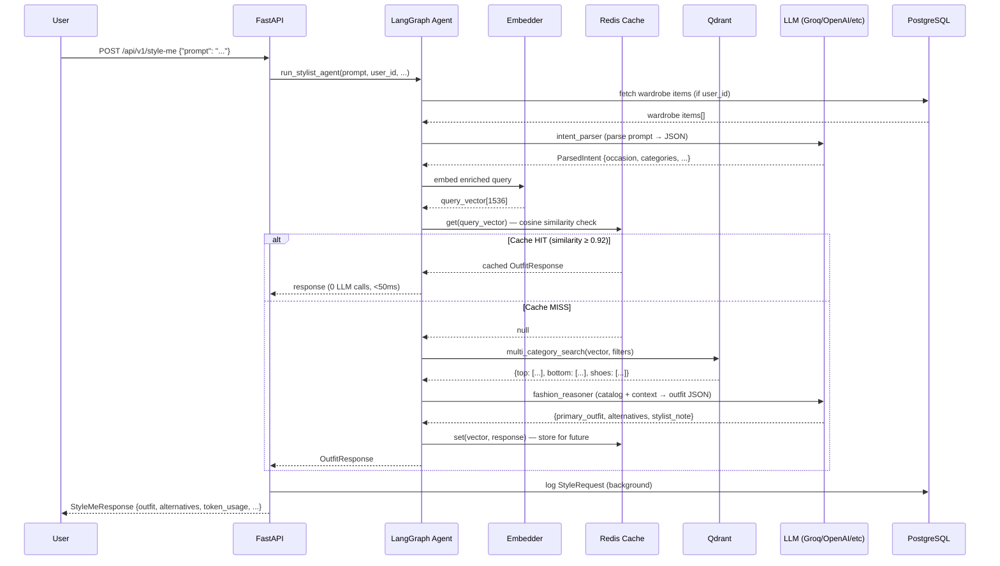

# System Flowchart — Stylist Concierge

```mermaid
flowchart TD
    U([👤 User]) -->|POST /api/v1/style-me\nprompt + optional params| API

    subgraph API["FastAPI Layer"]
        API[Request Validation\nPydantic v2] --> MW[Middleware\nRequest ID · Timing · CORS]
    end

    MW --> LG

    subgraph LG["LangGraph Agent (Stateful Graph)"]
        direction TB
        WL[🗂 Load Wardrobe\nfetch owned items\nfrom Postgres] --> IP

        IP[🧠 Intent Parser\nLLM extracts:\n• occasion\n• owned items\n• style keywords\n• formality\n• season\n• gender] --> EMBED

        EMBED[🔢 Embed Query\ntext-embedding-3-small\nquery vector] --> CC

        CC{🗃 Semantic\nCache Check\ncosine similarity\nvs Redis} 

        CC -->|similarity ≥ 0.92\nCACHE HIT| CF[⚡ Cache Formatter\nreturn stored result\n0 LLM tokens used]
        CC -->|similarity < 0.92\nCACHE MISS| RAG

        subgraph RAG["RAG Retrieval (parallel)"]
            RAG[🔍 Qdrant Search\nfilter: category · gender · price] --> T[Tops ×8]
            RAG --> B[Bottoms ×8]
            RAG --> S[Shoes ×8]
            RAG --> A[Accessories ×8]
        end

        T & B & S & A --> FR

        FR[👔 Fashion Reasoner\nLLM applies:\n• color theory\n• occasion rules\n• formality matching\n• shoe-trouser harmony\n• budget constraints] --> FMT

        FMT[📦 Response Formatter\n• build OutfitOption schema\n• sum token usage\n• write to cache\n• estimate cost]
    end

    CF --> RESP
    FMT --> RESP

    RESP[📋 StyleMeResponse\n• primary outfit + 2 alternatives\n• stylist note\n• parsed intent\n• token usage\n• agent trace\n• latency_ms] --> U

    subgraph INFRA["Infrastructure"]
        PG[(🐘 PostgreSQL\nusers · wardrobe\ncatalog · jobs\nrequests)]
        QD[(🔮 Qdrant\nvector DB\n1536-dim\nCOSINE)]
        RD[(🔴 Redis\nsemantic cache\nLRU 256MB)]
    end

    WL <-->|async SQLAlchemy| PG
    EMBED <-->|upsert / search| QD
    CC <-->|get / set| RD
    FMT -.->|background task\nlog request| PG

    subgraph SCRAPER["Scraper Pipeline (background)"]
        direction LR
        Z[🛍 Zara\nAPI + HTML] --> PIPE
        H[🛍 H&M\nAPI + HTML] --> PIPE
        M[🛍 Myntra\nAPI] --> PIPE
        PIPE[Pipeline\n• deduplicate\n• normalise\n• persist] --> EMB2[Batch Embed] --> QD2[(Qdrant\nupsert)]
        PIPE --> PG2[(Postgres\ninsert)]
    end

    style U fill:#f0f4ff,stroke:#4f6ef7
    style CF fill:#d4edda,stroke:#28a745
    style CC fill:#fff3cd,stroke:#ffc107
    style FR fill:#cce5ff,stroke:#004085
    style INFRA fill:#f8f9fa,stroke:#dee2e6
    style SCRAPER fill:#f8f9fa,stroke:#dee2e6
```

## Data Journey

